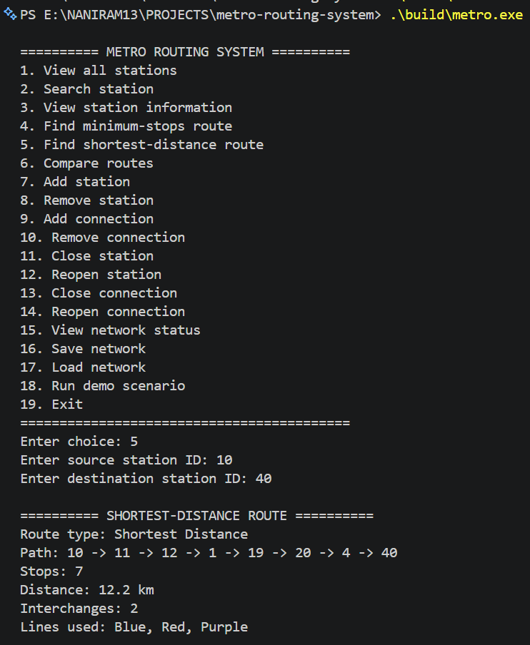
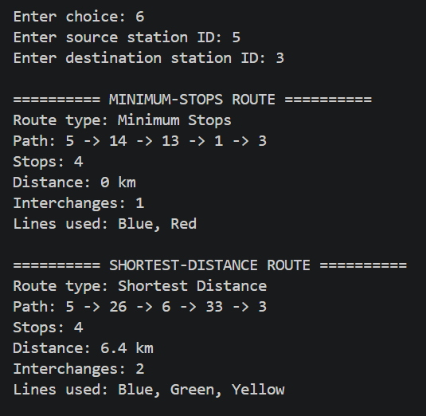
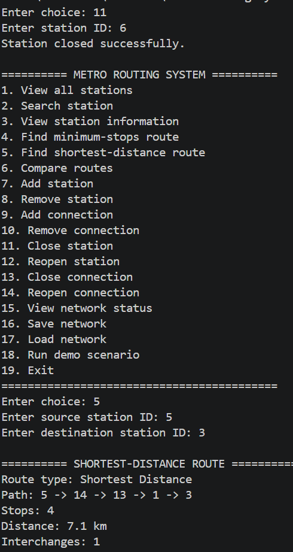
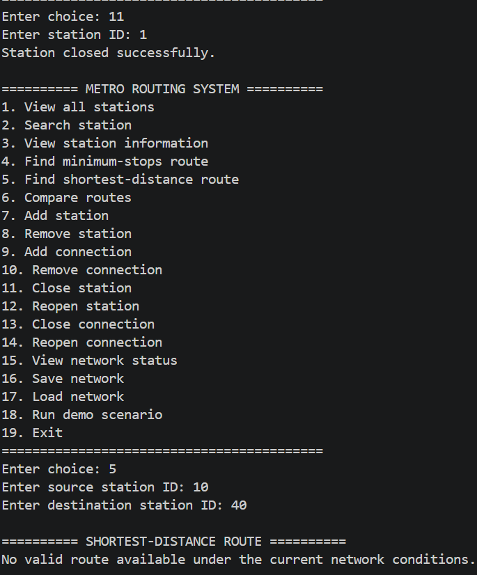

# Metro Routing System
A C++20 metro route planning and network management system using graph algorithms, network-state management, persistence, automated testing, and runtime benchmarking.
## Overview
The system models a metro network as a weighted graph. Stations are vertices, connections are weighted edges, and stations/connections can be `OPEN` or `CLOSED`.
## Problem Statement
The project demonstrates graph-based route planning with two objectives: minimum stops and minimum distance, while supporting temporary network disruptions and persistent network state.
## Features
- Station add/remove/search/list and line-based listing
- Weighted connection add/remove/open/close
- Validation of duplicate, invalid, and missing data
- BFS minimum-stops routing
- Dijkstra shortest-distance routing
- Path reconstruction and route comparison
- Station/connection disruption simulation
- Alternative-route calculation
- Save/load persistence
- Interactive 19-option CLI
- GoogleTest/CTest testing
- `std::chrono` benchmarking
## Architecture
```text
CLI
 ↓
MetroSystem
 ↓
MetroGraph + RouteEngine
 ↓
BFS / Dijkstra
 ↓
Path Reconstruction
 ↓
RouteResult
```
| Component | Responsibility |
|---|---|
| `Station` | Station data, lines, status |
| `Edge` | Endpoints, distance, status |
| `MetroGraph` | Weighted adjacency list and network state |
| `MetroSystem` | Management, validation, persistence |
| `RouteEngine` | BFS, Dijkstra, routing |
| `RouteResult` | Common route output |
| `CLI` | User interaction |
Detailed architecture: `docs/architecture.md`.
## Data Model
**Station:** ID, name, metro lines, interchange status, open/closed state.
**Edge:** source, destination, distance, open/closed state. Connections are undirected.
## Algorithms
### BFS — Minimum Stops
BFS explores the graph level by level and minimizes station-to-station transitions.
`Time: O(V + E)` · `Space: O(V)`
### Dijkstra — Shortest Distance
Dijkstra uses connection weights and a priority queue to minimize total distance.
`Time: O((V + E) log V)`
### Route Comparison
| Property | BFS | Dijkstra |
|---|---|---|
| Objective | Minimum stops | Minimum distance |
| Uses weights | No | Yes |
| Structure | Queue | Priority queue |
Both return a common `RouteResult`.
> **Interchange note:** Edges do not store line IDs, so interchange calculation is a station-based approximation.
## Network Disruption Simulation
Stations and connections remain in the graph when closed. Routing ignores closed components, supporting closures, reopening, alternative routes, and unreachable-route detection.
## Persistence
```text
#STATIONS
id,name,lines,status

#CONNECTIONS
from,to,distance,status
```
The loader validates malformed records, invalid or partially numeric values, unknown stations, and unexpected fields. Data is loaded into a temporary system before replacing the active network.
## CLI

The application provides 19 operations:

```text
1  View stations       2  Search station      3  Station info
4  Minimum-stops route 5  Shortest-distance   6  Compare routes
7  Add station         8  Remove station      9  Add connection
10 Remove connection  11 Close station       12 Reopen station
13 Close connection   14 Reopen connection   15 Network status
16 Save network       17 Load network         18 Demonstration
19 Exit
```
## Complexity Analysis
| Operation | Complexity |
|---|---|
| Station lookup | Average O(1) |
| Station insertion | Average O(1) |
| BFS | O(V + E) |
| Dijkstra | O((V + E) log V) |
## Testing
GoogleTest is integrated through CMake and CTest. **Verification:** 8 test suites · 37 test cases · 100% CTest pass rate.
Coverage includes stations, graph operations, connections, BFS, Dijkstra, disruptions, and persistence.
```powershell
ctest --test-dir build --output-on-failure
```
## Benchmarking
Measured with `std::chrono` over 1000 runs on the 51-station, 54-connection network.
| Algorithm | Average Time |
|---|---:|
| BFS | 31.747 μs |
| Dijkstra | 62.374 μs |
These are machine-specific measurements.
## Example Output
```text
Benchmarking route 10 -> 40
Network: 51 stations, 54 connections
BFS average time: 31.747 microseconds
Dijkstra average time: 62.374 microseconds
```
## Project Structure
```text
metro-routing-system/
├── data/
├── demo/
├── docs/
├── include/
├── screenshots/
├── src/
├── tests/
├── CMakeLists.txt
├── LICENSE
├── README.md
└── .gitignore
```
## Build Requirements
C++20-compatible compiler · CMake 3.20+ · Git · Internet connection for first GoogleTest download.
## Build Instructions
```powershell
git clone https://github.com/Thotakuriramcharan/metro-routing-system.git
cd metro-routing-system
cmake -S . -B build -G "MinGW Makefiles"
cmake --build build
```
## Run
```powershell
.\build\metro.exe
```
## Test
```powershell
ctest --test-dir build --output-on-failure
```
## Benchmark
```powershell
g++ -std=c++20 tests/benchmark.cpp src/Station.cpp src/Edge.cpp src/MetroGraph.cpp src/MetroSystem.cpp src/RouteEngine.cpp -Iinclude -o benchmark
.\benchmark.exe
```
## Design Decisions
Detailed decisions: `docs/design-decisions.md`.
Key choices: adjacency list, BFS for stops, Dijkstra for distance, separate `MetroGraph`/`RouteEngine`, text files instead of a database, CLI instead of web, GoogleTest/CMake, and explicit `OPEN`/`CLOSED` state.
## Challenges Faced
- Designing a weighted graph for metro connections
- Reconstructing paths for BFS and Dijkstra
- Handling network disruptions safely
- Validating malformed persistence data
- Integrating CMake and GoogleTest
## Lessons Learned
- How adjacency lists model real-world networks
- When BFS and Dijkstra are appropriate
- How to separate graph and routing responsibilities
- How automated testing improves reliability
- How benchmarking supports performance analysis
## Future Improvements
- Line-aware interchange routing
- Travel-time and transfer-aware routing
- Larger scalability benchmarks
- Stress/property-based testing
- GitHub Actions and cross-platform CI
- Static analysis and code coverage
- Network visualization and route export
## Limitations
- Interchange calculation is approximate because edges do not store line IDs.
- Benchmarking currently focuses on the 51-station network.
- Build workflow targets Windows/MinGW.
- Cross-platform CI is not currently included.
## Technical Stack
**C++20 · STL · CMake · GoogleTest · CTest · `std::chrono` · Git · GitHub · MinGW/GCC**
## Dataset
The full network contains **51 stations and 54 connections**. A smaller fixture is available at `data/mini_network.txt`.
## Project Status
Core routing, network management, disruption handling, persistence, CLI, testing, and benchmarking are implemented and verified.
**Verification:** 8 test suites · 37 test cases · 100% CTest pass rate · 51 stations · 54 connections · 19 CLI operations.
## Screenshots

Screenshots will document the main CLI workflows and route results.
### Normal Route



### Route Comparison



### Station Closure and Alternative Route



### No Available Route



## Demo

Four scenarios: normal minimum-stops route; stops-vs-distance comparison; disruption with alternative routing; no available route after disruption. A recording can be added after capture.

A short demonstration of the four main scenarios:

- Normal route
- Route comparison
- Station closure with alternative routing
- No available route

[Watch the demo](demo/metro-routing-demo.mp4)

## License
See the `LICENSE` file for the project license.
